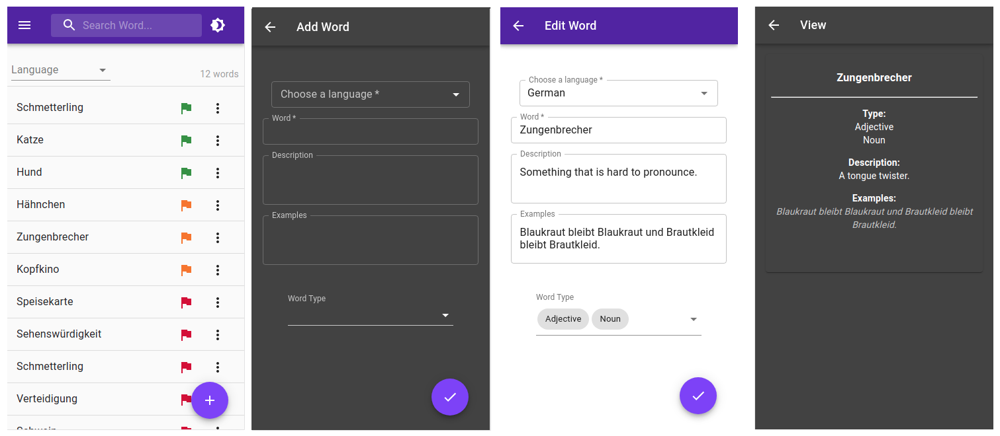

Simple app for language learning that I have made while learning React, mainly inspired by AnkiDroid. It uses Redux for state management, Json-server as a mock API and a bunch of Material-UI features like Dark-mode, Snackbars and Dialogs.

# Running the application

Currently, to run the application in development mode you have to run the following scripts in the project directory:

### `yarn start`

Runs the app in the development mode.\
Open [http://localhost:3000](http://localhost:3000) to view it in the browser.

### `npm run json-server`

Runs the mock back-end API for testing in the development mode.
It runs on [http://localhost:3004].
